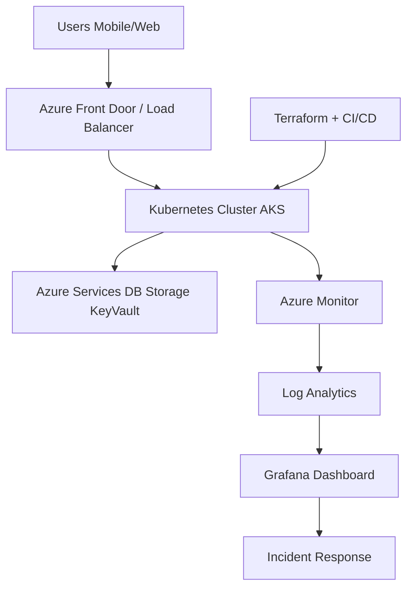
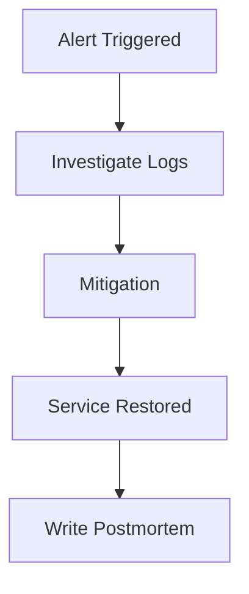
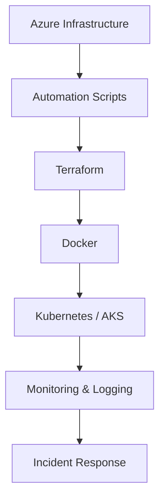

# Zero-to-SRE on Azure (8-Week Training Program)

**Goal:**
Transform a beginner into a **Junior Cloud Engineer / SRE** capable of building and maintaining a reliable cloud platform.

**Platform Scenario:**
A **Digital Advisory Platform** where users access financial insights, investments, and portfolio analytics.

---

# Program Structure

| Phase       | Weeks    | Focus                                  |
| ----------- | -------- | -------------------------------------- |
| Foundation  | Week 1–2 | Azure fundamentals and infrastructure  |
| SRE Mindset | Week 3–4 | Automation, scripting, CI/CD           |
| Scalability | Week 5–6 | Containers and Kubernetes              |
| Reliability | Week 7–8 | Monitoring, logging, incident response |

---

# Overall System Architecture



---

# Week 1 — Azure Fundamentals

## Real-World Scenario

If **1 million users open the advisory app Monday morning**, where does the app run?

## Layman Explanation

| Concept        | Analogy                                          |
| -------------- | ------------------------------------------------ |
| Cloud          | Renting an apartment instead of building a house |
| Region         | Choosing a city to host your office              |
| Resource Group | A labeled storage box                            |
| VM             | Renting a computer in the cloud                  |

## Azure Services

* Azure Portal
* Azure Resource Groups
* Azure App Service
* Azure Cloud Shell

## Hands-On Lab

1. Create Azure Free Account
2. Create Resource Group

```bash
az group create --name rg-zero-sre --location eastus
```

3. Deploy simple web app

## Incident Simulation

Problem:

```text
Website shows 503 error
```

Troubleshooting

* Check service status
* Check deployment logs
* Verify resource group

---

# Week 2 — Azure Global Infrastructure

## Real-World Scenario

Users connect from **India, Europe, and the US**.

How does Azure ensure **fast response and reliability**?

## Layman Explanation

| Concept           | Analogy         |
| ----------------- | --------------- |
| Region            | Branch office   |
| Availability Zone | Backup building |
| Load Balancer     | Traffic police  |

## Core Azure Networking

* Virtual Network
* Subnets
* Public IP
* Network Security Groups

## Hands-On Lab

Create network

```bash
az network vnet create \
  --name sre-vnet \
  --resource-group rg-zero-sre \
  --subnet-name web-subnet
```

## Incident Simulation

Problem:

```text
VM cannot be accessed
```

Check

* Firewall rules
* Public IP
* Subnet configuration

---

# Week 3 — Automation Fundamentals

## Real-World Scenario

Deploying infrastructure manually **10 times per week** leads to mistakes.

Automation solves this.

## Layman Explanation

| Concept    | Analogy         |
| ---------- | --------------- |
| Script     | Cooking recipe  |
| Automation | Washing machine |
| CLI        | Remote control  |

## Tools

* Azure CLI
* PowerShell
* Python

## Hands-On Lab

Create resource via script

```bash
for i in {1..3}
do
az group create --name demo-$i --location eastus
done
```

## Incident Simulation

Problem

```text
Script partially executed
```

Solution

* Check error logs
* Retry failed step
* Add validation

---

# Week 4 — Infrastructure as Code

## Real-World Scenario

Deployment environments must remain **consistent across dev, test, and production**.

## Layman Explanation

| Concept                | Analogy               |
| ---------------------- | --------------------- |
| Terraform              | House blueprint       |
| Infrastructure as Code | Written building plan |

## Tools

* Terraform
* GitHub Actions
* Azure DevOps

## Terraform Example

```hcl
resource "azurerm_resource_group" "example" {
  name     = "rg-sre-demo"
  location = "East US"
}
```

Deploy

```bash
terraform init
terraform plan
terraform apply
```

## Incident Simulation

Problem

```text
terraform apply failed
```

Check

* State file
* Resource conflict
* Quotas

---

# Week 5 — Containers

## Real-World Scenario

Developers want to deploy applications quickly without dependency conflicts.

Containers solve this.

## Layman Explanation

| Concept   | Analogy                         |
| --------- | ------------------------------- |
| Container | Lunchbox with everything inside |
| Image     | Recipe                          |
| Registry  | Food warehouse                  |

## Tools

* Docker
* Azure Container Registry

## Docker Example

```dockerfile
FROM python:3.9
COPY app.py .
CMD ["python","app.py"]
```

Build

```bash
docker build -t sre-app .
docker run -p 5000:5000 sre-app
```

## Incident Simulation

Problem

```text
Container exits immediately
```

Check

* Logs
* Entry command
* Ports

---

# Week 6 — Kubernetes and AKS

## Real-World Scenario

Traffic suddenly increases **20x during market volatility**.

Kubernetes automatically scales services.

## Layman Explanation

| Concept    | Analogy            |
| ---------- | ------------------ |
| Kubernetes | Restaurant manager |
| Pod        | Worker             |
| Deployment | Staffing plan      |

## Example Deployment

```yaml
apiVersion: apps/v1
kind: Deployment
metadata:
  name: advisory-app
spec:
  replicas: 3
```

## Hands-On Lab

Scale pods

```bash
kubectl scale deployment advisory-app --replicas=5
```

## Incident Simulation

Problem

```text
Pod crash loop
```

Check

```text
kubectl logs
kubectl describe pod
```

---

# Week 7 — Monitoring and Observability

## Real-World Scenario

Customers report slow response.

Monitoring identifies the cause.

## Layman Explanation

| Concept | Analogy            |
| ------- | ------------------ |
| Metrics | Speedometer        |
| Logs    | Black box recorder |
| Alerts  | Smoke alarm        |

## Azure Tools

* Azure Monitor
* Log Analytics
* Grafana

## Sample Query (KQL)

```kql
AzureActivity
| where TimeGenerated > ago(1h)
| summarize count() by ResourceGroup
```

## Incident Simulation

Problem

```text
CPU spike detected
```

Steps

* Check metrics
* Check logs
* Check deployment history

---

# Week 8 — Incident Response and Reliability

## Real-World Scenario

At **9 AM the platform stops responding**.

SRE must stabilize quickly.

## SRE Principles

* Detect early
* Reduce blast radius
* Automate recovery
* Conduct blameless postmortem

## Incident Workflow



## Capstone Project

Build a **mini SRE platform**

Includes:

* Terraform infrastructure
* Containerized application
* Kubernetes deployment
* Monitoring dashboard
* Alert system

---

# SRE Skill Pyramid



---

# Golden Rules of SRE

1. Automate everything possible
2. Measure system health continuously
3. Assume failure will happen
4. Design systems to scale
5. Reduce manual work
6. Learn from incidents
7. Build resilient architectures

---

# Final Outcome

After completing the program, the learner can:

* Deploy applications in Azure
* Automate infrastructure
* Use Terraform
* Build containerized workloads
* Deploy to Kubernetes
* Monitor systems
* Handle production incidents

This makes them ready for a **Junior Cloud Engineer / SRE role**.

---

# Suggested Repository Structure

```text
zero-to-sre-azure/
 ├─ README.md
 ├─ terraform/
 ├─ docker/
 ├─ kubernetes/
 ├─ scripts/
 ├─ labs/
 └─ monitoring/
```
